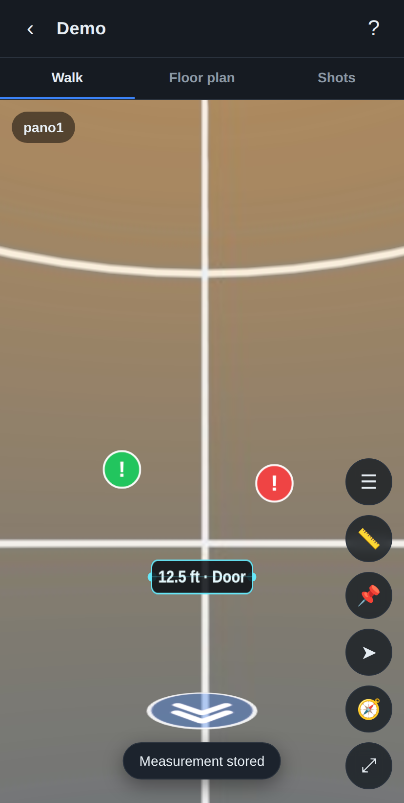

# SiteWalk — 360° site tours on your phone

Build a walkable, Matterport-style tour of a job site from the 360° photos you
shoot with an **Insta360** (or any equirectangular 360 camera). Import the shots,
drop navigation arrows to connect them, lay them out on a floor plan, and tag
notes on walls or equipment. It all runs in your phone's browser, installs to
your home screen, and works **offline** — no account, no server, nothing leaves
your phone.



## What it does

- **Import 360° photos** — export equirectangular (2:1) stills from the Insta360
  app to your camera roll, then pick them here (multiple at once).
- **True 360° viewing** — drag, pinch-to-zoom, or use your phone's motion sensor
  (gyro) to look around each spot.
- **Walk the space, both ways** — drop a **path arrow** (➤) on the floor toward a
  doorway and pick the shot through it. SiteWalk creates the forward arrow **and
  a matching arrow back**, so you're never stuck. A **Back** button (↩) also
  steps through your history at any time.
- **Choose the arrival view** — when you link two shots you set the exact
  direction you'll be facing when you arrive (and when you come back), so the
  walk flows naturally.
- **Priority notes** — pin note tags (📌) and flag them **High / Medium / Low**;
  the pin is colored red / amber / green to match.
- **Measurements** — mark two points with the measure tool (📏) and log the
  distance you measured (with your tape/laser) plus a label. Stored on the shot
  as a labeled line.
- **Manage any stop** — the ☰ panel lists every arrow, note and measurement on a
  shot so you can edit, delete, or re-set an arrow's arrival view.
- **Revise a photo** — replace a shot's image while keeping all its arrows,
  notes and floor-plan position.
- **Floor plan** — optionally set a floor-plan image, then place each shot as a
  numbered dot. Tap a dot to jump there; links between shots are drawn for you.
- **Backup & share** — export a whole tour as a single `.sitewalk` file and
  import it on another device.

## How to use it

1. **Shoot** each spot with the Insta360 app (one capture every few metres).
2. **Export** each as a flat **equirectangular** photo to your phone's photos.
3. Open SiteWalk → **New tour** → **Shots** tab → **+** → pick your photos.
4. Open a shot, tap **➤**, tap the floor toward a doorway, pick the shot through
   it, then turn to the arrival view and tap **✓ Set view**. Repeat to build the
   walk. Tap a floor arrow to move; tap **↩** to go back.
5. Tap **📌** for a priority note, or **📏** to record a measurement.
6. Tap **☰** to review/edit everything on the current stop.
7. On the **Floor plan** tab, place each shot as a dot.

Tap **?** in the app anytime for these steps.

### A note on measurements

A single 360° photo has no depth data, so distances can't be computed
automatically. The measure tool stores the value **you** record with a tape or
laser, tied to the two points you tap and to that shot — a reliable field log,
not a guess.

## Running it

It's a static web app — no build step.

**On your phone (recommended):** host the folder over HTTPS and open it in
Safari/Chrome, then "Add to Home Screen" to install it as an app. Two easy hosts:

- **GitHub Pages:** push this repo, then enable Pages (Settings → Pages → deploy
  from branch, root). Your app will be at
  `https://<user>.github.io/<repo>/`.
- **Any static host** (Netlify, Vercel, Cloudflare Pages): point it at this
  folder.

> A service worker + camera-roll access require **HTTPS** (or `localhost`), so
> open the hosted URL rather than a `file://` path on your phone.

**Locally, to try it on a computer:**

```bash
python3 -m http.server 8000
# then open http://localhost:8000
```

## What this is (and isn't)

SiteWalk builds a fast, connected **360° photo walkthrough** — the part of
Matterport people use most. It intentionally does **not**:

- control the Insta360 camera directly (that's Insta360's own app/SDK — you
  shoot there and export here), or
- generate an automatic 3D mesh / "dollhouse" view, which needs depth data or
  heavy photogrammetry a phone browser can't do from flat photos alone.

If you later want the dollhouse/measurement features, the natural next step is a
server-side photogrammetry pipeline; the tour data here is structured to grow
into that.

## Tech

- Vanilla JS ES modules, no framework
- [Three.js](https://threejs.org/) (vendored in `js/vendor/`) for the WebGL
  panorama sphere
- IndexedDB for offline storage of photos and tour data
- A service worker + web manifest make it an installable, offline PWA

## Project layout

```
index.html              app shell
css/styles.css          styles
js/app.js               controller / routing / flows
js/db.js                IndexedDB storage + export/import
js/image.js             photo decode, downscale, thumbnails
js/viewer.js            WebGL 360° panorama viewer + hotspots + gyro
js/map.js               floor-plan canvas (place/drag/link dots)
js/ui.js                modals, prompts, toasts, help
js/vendor/              Three.js (bundled for offline use)
service-worker.js       offline cache
manifest.webmanifest    installable PWA metadata
icons/                  app icons
```

## Privacy

Everything stays on your device in the browser's storage. There is no backend
and no analytics. Use **Export** to make your own backups.
